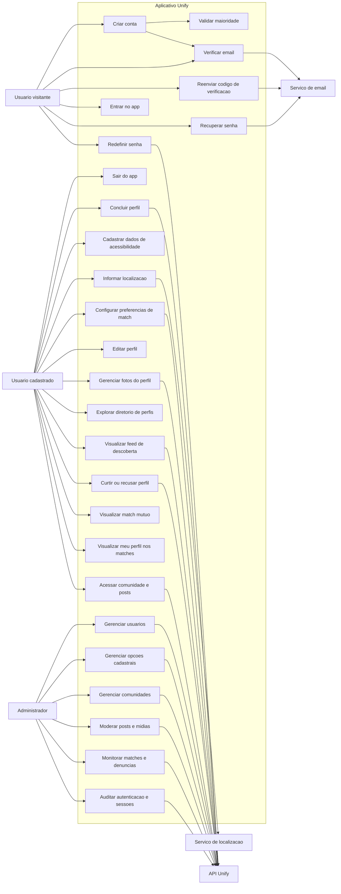

# Unify - Casos de uso e requisitos

## Base analisada

Este documento foi elaborado com base no frontend Expo/React Native do projeto. Os principais fluxos identificados aparecem nas rotas `app/auth`, `app/onboarding`, `app/profile`, `app/matches`, `app/community`, `app/explore` e nos serviços `authService`, `profileService`, `matchService` e `communityService`.

Observacao importante: o frontend atual nao possui telas administrativas explicitas nem controle de papeis visivel no codigo. Por isso, os casos de uso de administrador abaixo representam responsabilidades necessarias/inferidas para operar a plataforma e sustentar os dados consumidos pelo aplicativo, como opcoes de perfil, comunidades, usuarios, conteudos e seguranca.

## Atores

- Usuario visitante: pessoa nao autenticada que acessa login, cadastro, verificacao de email e recuperacao de senha.
- Usuario cadastrado: pessoa autenticada que conclui onboarding, edita perfil, configura preferencias, explora perfis, da match e acessa comunidade.
- Administrador: perfil operacional responsavel por gerir usuarios, opcoes cadastrais, comunidades, conteudos e monitoramento da plataforma.
- Servico de email: sistema externo/back-end responsavel por enviar codigos de verificacao e links de redefinicao.
- Servico de localizacao: permissao/recurso do dispositivo usado para obter latitude e longitude.
- API Unify: back-end responsavel por autenticar, persistir dados, aplicar regras de negocio e retornar feeds.

## Diagrama de casos de uso

## Requisitos funcionais

### Autenticacao e conta

RF01 - Cadastro de usuario: o sistema deve permitir que um visitante crie conta informando nome, sobrenome, email, data de nascimento e senha.

RF02 - Validacao de campos obrigatorios: o sistema deve impedir o cadastro quando nome, sobrenome, email, data de nascimento ou senha nao forem informados.

RF03 - Politica de senha: o sistema deve exigir senha com no minimo 8 caracteres, letra maiuscula, letra minuscula, numero e caractere especial.

RF04 - Restricao de maioridade: o sistema deve bloquear o cadastro de usuarios menores de 18 anos e direcionar para uma tela informativa.

RF05 - Normalizacao de email: o sistema deve normalizar emails antes de chamar endpoints de cadastro, login, verificacao e recuperacao.

RF06 - Verificacao de email: o sistema deve enviar o usuario para a tela de codigo apos o cadastro e permitir validar um codigo de 6 caracteres.

RF07 - Reenvio de codigo: o sistema deve permitir reenviar o codigo de verificacao para o email pendente.

RF08 - Bloqueio por email nao verificado: o sistema deve impedir acesso ao app quando houver email pendente de verificacao e manter o usuario na etapa de codigo.

RF09 - Login: o sistema deve permitir login por email e senha e salvar a sessao autenticada quando a API retornar tokens validos.

RF10 - Recuperacao de senha: o sistema deve permitir solicitar link de redefinicao por email.

RF11 - Redefinicao de senha: o sistema deve permitir redefinir a senha usando token recebido no link.

RF12 - Logout: o sistema deve permitir encerrar sessao, chamar o endpoint de logout quando houver sessao ativa e limpar dados locais de autenticacao.

RF13 - Protecao de rotas: o sistema deve redirecionar usuarios nao autenticados para login ao tentar acessar rotas internas.

RF14 - Redirecionamento pos-login: o sistema deve consultar a conclusao do perfil e encaminhar o usuario para onboarding de perfil, preferencias de match ou home.

### Onboarding e perfil

RF15 - Consulta de opcoes de perfil: o sistema deve carregar opcoes de genero, pronomes, deficiencias, necessidades de acessibilidade, autonomia, comunicacao, estilo de vida, energia, interesses, linguagens do amor, tipos de conexao e preferencias de similaridade.

RF16 - Cadastro de perfil: o sistema deve permitir salvar bio, genero, pronomes, deficiencias, necessidades de acessibilidade, autonomia, formas de comunicacao, estilo de vida, energia, interesses, linguagens do amor e localizacao.

RF17 - Conclusao do onboarding de perfil: o sistema deve verificar campos ausentes e redirecionar para preferencias de match somente apos concluir os dados obrigatorios de perfil.

RF18 - Permissao de localizacao: o sistema deve consultar e solicitar permissao de localizacao do dispositivo quando o usuario quiser usar criterios de distancia.

RF19 - Uso opcional de localizacao: o sistema deve permitir continuar o fluxo mesmo sem permissao de localizacao, exibindo orientacao adequada.

RF20 - Edicao de perfil: o sistema deve permitir que o usuario autenticado edite os mesmos dados informados no onboarding.

RF21 - Visualizacao de perfil: o sistema deve exibir dados pessoais, bio, idade, acessibilidade, interesses, comunicacao e demais atributos publicos do perfil.

RF22 - Upload de foto principal: o sistema deve permitir selecionar imagem da camera ou galeria e enviar como foto principal.

RF23 - Upload de galeria: o sistema deve permitir enviar imagens adicionais para a galeria do perfil.

RF24 - Remocao de imagem: o sistema deve permitir excluir imagens ativas do perfil.

RF25 - Resolucao de URL de imagem: o sistema deve transformar caminhos relativos de imagens em URLs absolutas usando a URL base da API.

### Preferencias e matches

RF26 - Cadastro de preferencias de match: o sistema deve permitir configurar tipo de conexao, faixa etaria minima e maxima, distancia maxima, generos desejados e preferencias de similaridade.

RF27 - Edicao de preferencias de match: o sistema deve permitir alterar preferencias ja cadastradas a partir do perfil ou da area de matches.

RF28 - Consulta do feed de descoberta: o sistema deve buscar perfis recomendados para match enviando IDs ja utilizados para evitar repeticao.

RF29 - Montagem do perfil de match: o sistema deve exibir nome, idade, bio, foto, distancia, genero, pronomes, deficiencias, autonomia, necessidades, comunicacao, energia, estilo de vida, interesses, linguagens do amor e tipo de conexao.

RF30 - Aceitar perfil: o sistema deve permitir curtir um perfil, registrando `accepted=true`.

RF31 - Recusar perfil: o sistema deve permitir rejeitar um perfil, registrando `accepted=false`.

RF32 - Match mutuo: quando a resposta indicar `mutualMatch=true`, o sistema deve direcionar para uma tela de sucesso com dados da pessoa correspondente.

RF33 - Listagem de matches mutuos: o sistema deve permitir consultar matches mutuos do usuario autenticado.

RF34 - Meu perfil nos matches: o sistema deve permitir visualizar como o proprio perfil aparece no contexto de encontros.

### Comunidade e exploracao

RF35 - Diretorio de perfis: o sistema deve permitir consultar e listar perfis disponiveis no endpoint de diretorio.

RF36 - Feed de comunidade: o sistema deve permitir consultar comunidade ativa e posts associados.

RF37 - Cabecalho de comunidade: o sistema deve exibir nome, descricao, icone, quantidade de membros e estado de participacao quando retornados pela API.

RF38 - Posts da comunidade: o sistema deve exibir autor, data, corpo do post, midia, curtidas e comentarios quando disponiveis.

### Administrador

RF39 - Gestao de usuarios: o administrador deve poder consultar, ativar, bloquear ou revisar usuarios conforme regras da plataforma.

RF40 - Gestao de opcoes cadastrais: o administrador deve poder manter opcoes usadas no perfil e preferencias, como generos, pronomes, acessibilidade, interesses e tipos de conexao.

RF41 - Gestao de comunidades: o administrador deve poder criar, editar, ativar e desativar comunidades exibidas no app.

RF42 - Moderacao de posts e midias: o administrador deve poder remover ou ocultar conteudos inadequados de comunidades e perfis.

RF43 - Monitoramento de matches: o administrador deve poder acompanhar indicadores e ocorrencias relacionadas a matches, preservando privacidade dos usuarios.

RF44 - Auditoria de autenticacao: o administrador deve poder acompanhar eventos relevantes de conta, verificacao, recuperacao de senha, refresh token e logout.

RF45 - Controle de acesso administrativo: o sistema deve restringir funcionalidades administrativas a contas com permissao apropriada.

## Requisitos nao funcionais

RNF01 - Seguranca de autenticacao: tokens de acesso e refresh devem ser armazenados em mecanismo seguro do dispositivo sempre que disponivel.

RNF02 - Renovacao de sessao: o sistema deve tentar renovar o access token com refresh token em requisicoes autenticadas que retornem 401, evitando logout desnecessario.

RNF03 - Encerramento de sessao invalida: o sistema deve limpar a sessao local quando a API retornar 401 ou 403 em rotas autenticadas apos tentativa de refresh.

RNF04 - Privacidade: dados sensiveis de perfil, acessibilidade, localizacao e preferencias devem ser transmitidos apenas por requisicoes autenticadas e protegidas.

RNF05 - Consentimento de localizacao: o uso de latitude e longitude deve depender de permissao explicita do usuario.

RNF06 - Tolerancia a falhas: o app deve exibir mensagens de erro compreensiveis para falhas de rede, validacao ou API.

RNF07 - Experiencia de carregamento: telas que aguardam autenticacao, API ou upload devem exibir estado de carregamento e impedir acoes duplicadas.

RNF08 - Compatibilidade mobile: o app deve funcionar em Android, iOS e Web conforme dependencias Expo/React Native configuradas.

RNF09 - Usabilidade: formularios devem orientar o usuario com placeholders, mensagens de erro, estados desabilitados e feedback visual.

RNF10 - Acessibilidade: a interface deve favorecer navegacao clara, contraste adequado e rotulos de acessibilidade em acoes importantes, especialmente no fluxo de match.

RNF11 - Internacionalizacao local: textos e formatos visiveis devem ser adequados ao publico brasileiro, incluindo data de nascimento no formato `pt-BR`.

RNF12 - Configuracao por ambiente: a URL base da API deve ser resolvida por perfil de execucao, suportando desenvolvimento, homologacao e producao.

RNF13 - Integridade dos dados: o sistema deve enviar IDs de opcoes catalogadas em vez de descricoes livres nos campos estruturados de perfil e preferencias.

RNF14 - Manutenibilidade: tipos TypeScript devem representar contratos de autenticacao, perfil, match e comunidade para reduzir divergencias entre frontend e API.

RNF15 - Performance de rede: requisicoes independentes de carregamento, como perfil e opcoes, devem ser executadas em paralelo quando possivel.

RNF16 - Upload seguro: envio de imagens deve usar `FormData` e preservar cabecalhos adequados sem forcar `Content-Type` JSON.

RNF17 - Recuperabilidade: fluxos de email nao verificado e senha esquecida devem permitir retomar o acesso sem intervencao manual do suporte.

RNF18 - Observabilidade administrativa: o back-end deve registrar eventos suficientes para auditoria e operacao segura das funcoes administrativas.

RNF19 - Consistencia visual: telas internas devem manter navegacao inferior e padroes visuais coerentes entre home, matches, comunidade e perfil.

RNF20 - Escalabilidade funcional: a arquitetura deve permitir adicionar novas opcoes de perfil, comunidades e regras de match sem reescrever telas principais.

